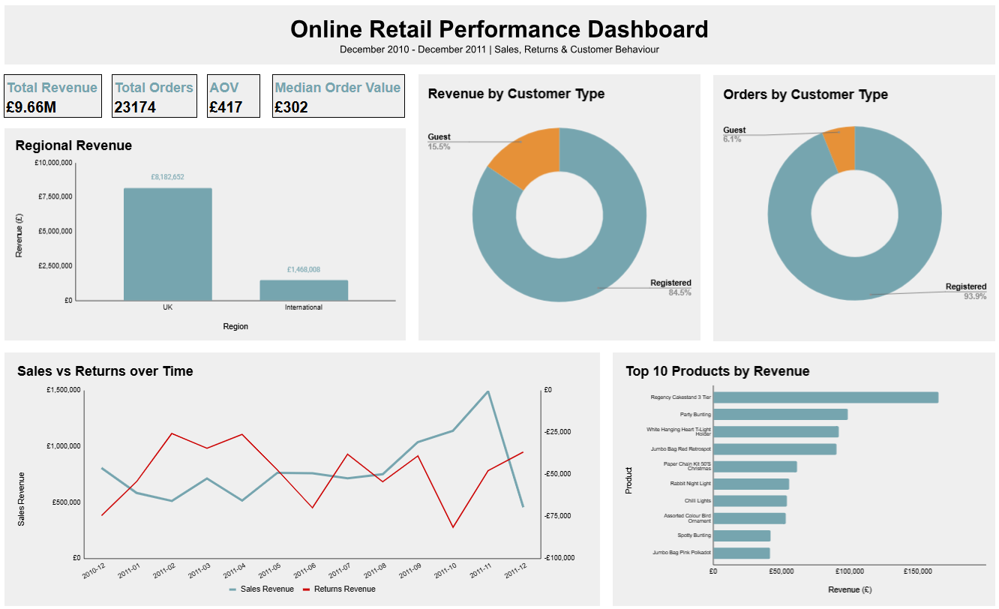

# Online Retail Customer & Revenue Analysis Project

## Project Overview

In this project I used a large online retail dataset and aimed to understand customer purchasing behaviour and analyse revenue trends. The analysis culminated in a Google Sheets dashboard and a series of business insights. The dataset was inconsistent and contained numerous quality issues, cleaning it was a main portion of the project to ensure data accuracy when analysing it. The final analysis focused on product-related transactions to guarantee that KPIs and visualisations accurately reflect sales performance.

## Dataset

**Link to kaggle dataset:**  
[ECommerce unclean dataset](https://www.kaggle.com/datasets/hashemili/ecommerce-unclean-dataset)  
*This dataset holds records dated between December 2010 and December 2011, these records are online retail transactions. It includes information on invoices, products, quantities, prices, customers and countries, making it ideal for analysis of customer behaviour and revenue.*

**Link to full project workbook:**  
[E-Commerce Data Interactive Workbook](https://docs.google.com/spreadsheets/d/1yrCquC9e222f4YXYZ0rwL8WH8cB8IAFYKruOx7Kf4k8/edit?gid=870338038#gid=870338038)  
*This is the workbook with the entire cleaned dataset, pivot table sheet, and dashboard. The repository contains sample files due to GitHub file size limitations.*

**Dataset Size:**
- Original dataset: 541,910 rows
- Final cleaned dataset: 539,696 rows

## Data Cleaning
The dataset contained numerous inconsistencies, atypical records and formatting issues that required cleaning prior to analysis. A key objective throughout the cleaning process was that the final analysis should exclusively be on product-related transactions. Therefore these steps were taken to improve data quality, standardise fields and ensure accurate reporting and visualisation:

#### Entire sheet:
- Removed duplicate rows to prevent double-counting during aggregation and analysis.
- Trimmed white spaces to ensure consistent grouping and accurate filtering.

#### InvoiceNo:
- Created a TransactionType field to distinguish between sales and returns based on the "C" prefix.
- Created a CleanInvoiceNo field by removing prefixes to standardise invoice identifiers for grouping.

#### StockCode:
- Created a BaseStockCode field to extract the core product identifier from codes with suffixes.
- Created an ItemType field to classify stock codes into:
  - Product
  - Adjustment
  - Discount
  - Shipping
  - Fee
  - Other
- This guarantees the distinction between product and non-product transactions.

#### Description:
- Removed rows with unusable or missing descriptions.
- Standardised text formatting to improve readability and grouping.
- Identified and removed anomalous or non-product descriptions (operational notes and placeholders).
- Kept meaningful product descriptions for accurate analysis.

#### Quantity:
- Validated that all values are numeric for reliable calculations. Found ~400 inconsistencies where negative quantities were not labelled as returns, these were identified as inventory adjustments and were removed.
- Confirmed  no zero-quantity rows, ensuring only meaningful records are kept.
- Identified and removed bulk wholesale transactions (extremely high quantity orders) to ensure the key metrics reflect typical customer purchasing behaviour and not large business orders.

#### InvoiceDate:
- Verified there were no missing values.
- Identified inconsistent datetime formats and mixed data types.
- Constructed a new standardised field by extracting and recombining date and time components.
- Standardised the entire column into a datetime format usable for analysis
- Replaced the original column with the values from the cleaned version

#### UnitPrice:
- Validated all values are numeric and formatted them to two decimal places.
- Investigated zero-value transactions.
  - Retained zero-value product entries.
  - Removed zero-value non-product entries.
- This was done to ensure only data useful for analysis is kept.
- Removed extreme negative-value records linked to financial adjustments, as they do not represent sales activity.
- Ensured only revenue relevant values remained.

#### CustomerID:
- Identified ~132,000 missing values, retained these and classified customer ID as either a registered or guest customer type.
- Created a CustomerType field to differentiate between these when analysing or visualising to ensure data accuracy.
- Ensured all valid CustomerID values are correctly formatted.

#### Country:
- Verified no missing values.
- Standardised inconsistent country naming (i.e changing RSA to South Africa and EIRE to Ireland).
- Fixed ambiguous entries:
  - Unspecified to Unknown.
  - European Community changed to Europe.
- Checked for hidden duplicates.
- Analysed distribution and identified the United Kingdom as the dominant market.

#### Region
- Created a Region field to group transactions into:
  - UK
  - International
- Enables a different level of analysis.

## Dashboard
***This dashboard was built in Google Sheets to analyse revenue performance, customer behaviour, regional trends, product performance and returns over time.***  

## Key Insights

#### Revenue Trend:
Revenue generally trends upwards throughout the year, it spikes in November and drops rapidly in December. This suggests a substantial seasonal demand during the Christmas Period. Understanding these seasonal patterns can help inform staffing decisions and inventory planning to maximise sales during peak periods.

#### Customer Behaviour:
Registered customers dominate in revenue production and order volume, generating 84.5% of revenue and making up 93.9% of orders. This suggests that the business depends heavily on repeat purchasing behaviour. Loyalty incentives and strategies for retention will provide long term value as opposed to focusing on new customer acquisition.

#### Product Performance Insight:
The highest revenue is generated by the Regency Cakestand with over £150,000 worth of sales. The next 3 best-sellers are the Party Bunting, Hanging Heart T-Light Holder and Jumbo Bag Red Retrospot, all of which generate considerably more revenue than the remaining products in the top 10. This signifies that revenue is concentrated among a small number of products. These insights assist in understanding the volume of stock that should be held for each product to ensure customer satisfaction and capitalise on periods of high demand.

#### Regional Insight:
The UK preponderates the regional market, producing over 80% of the total revenue. This highlights a large customer base within the UK and a significant gap in production rates between the regions. An insight like this influences where marketing efforts are best placed and aids with resource allocation.

#### AOV vs Median:
The Average Order Value (£417) is significantly higher than the Median Order Value (£302). This indicates that a relatively small number of high-value transactions are skewing the overall average upward. However, the median order value remains comparatively high which suggests that customer orders are typically of substantial value. Categorising wholesale customers separately could offer a clearer insight into typical purchasing behaviour.

## Recommendations

**Customer Retention:**  
Considering that registered customers generate the majority of revenue, retention of customers should be prioritised through targeted promotions, loyalty programmes and personalised email marketing campaigns.

**Product Strategy:**  
Given that a large proportion of revenue is generated by a small number of products, ensuring stock availability of these products should take precedence. Additionally, maximising the sales of these products should remain a core focus, achieved through product bundling and promotional campaigns.

**Regional Expansion:**  
We see that the UK dominates the regional market, highlighting an opportunity for international growth. This could be explored through targeted marketing, analysis of top performing products by country and optimising shipping processes to improve customer experience.

**Returns Management:**  
Reducing return rates as much as possible is a top priority, this can be accomplished by monitoring high return periods and products to gain knowledge on the causes. Using these findings the business can then improve areas that contribute to increased returns, such as product descriptions, quality control, packaging and shipping.

**Customer Segmentation:**  
Further analysis of the average order value and median order value by separating high-value/wholesale orders will give a clearer understanding of customer behaviour. The insights gained from this analysis will improve decision-making to support revenue growth. Furthermore, building segmented reporting as a standard practice in the future will benefit overall analysis.

## Skills Demonstrated
- Data Cleaning
- Data Validation
- Data Transformation
- Pivot Table Analysis
- KPI Development
- Dashboard Design
- Business Analysis
- Data Storytelling
